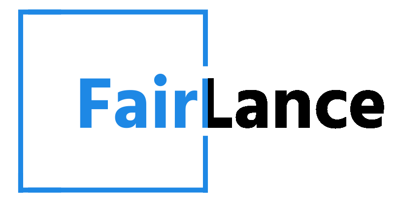
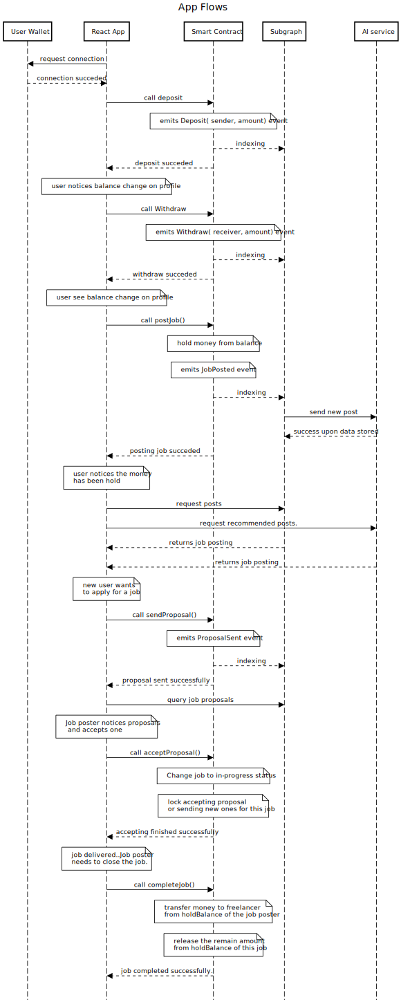

# **FairLance**

FairLance is an innovative platform that revolutionizes the freelancing industry by providing fair opportunities to freelancers worldwide. Our website leverages decentralized technologies to transcend geographical boundaries, empowering freelancers to expand their reach without worrying about excessive fees, unlike other conventional freelancing platforms. With our new payment method, users experience a significant positive impact, as it eliminates numerous limitations that currently exist in the industry, transforming the way freelancers and service providers operate.

## Overview

We seek to create equal opportunities for freelancers regardless of their location or nationality. By embracing cryptocurrencies, we ensure secure and borderless payments for all users. The vision behind Fairlance revolves around inclusivity and fairness. The way Fairlance is designed guarentees nobody has the ability to impose any restrictions based on specific locations and/or pay discrepancies based on nationalities.

Our mission is to revolutionize the freelancing landscape, providing a level playing field for talented individuals to thrive and collaborate with clients from all around the world.

## Contents

  - [AI Services](https://github.com/HaidarJbeily7/soft-codehack-hackathon/tree/main/ai-services)
  - [Smart Contract](https://github.com/HaidarJbeily7/soft-codehack-hackathon/tree/main/smart-contract)
  - [Frontend](https://github.com/HaidarJbeily7/soft-codehack-hackathon/tree/main/frontend)
  - [Subgraph](https://github.com/HaidarJbeily7/soft-codehack-hackathon/tree/main/subgraph)

## :zap: Key Features

- **Decentralized Platform:** FairLance utilizes decentralized technologies to remove geographical restrictions and excessive fees, allowing freelancers to access a global client base effortlessly.

- **Equal Opportunities:** We promote inclusivity and equal opportunities for all freelancers, regardless of their background, location, or nationality.

- **Secure Cryptocurrency Payments:** Our platform ensures secure and fast payments using cryptocurrencies, providing enhanced security and privacy for freelancers and clients.

- **AI Services Integration:**
  - **Tags Inferring:** FairLance automatically identifies relevant tags for job postings based on the content provided in the post's title and description. This supplements manual tags set by the job poster to enhance post visibility and categorization.
  
  - **Recommendation System:** Enhancing the job-seeking experience, FairLance recommends job posts that match a freelancer's skills and preferences. By understanding a freelancer's expertise and past interactions, we suggest jobs that align with their interests and strengths.

- **User-Friendly Interface:** Our intuitive user interface makes it easy for both freelancers and clients to navigate and interact effectively.

## :computer: Tech Stack

- **Frontend:**
  - Javascript.
  - ReactJS.
  - Styled Components.
  - Wagmi.
  - ConnectKit.
  - Eathers.js.
  - framer-motion.
- **Smart Contract:**
  - Solidity.
  - HardHat.
- **Subgraph:**
  - The Graph Protocol
- **AI Services:**
  - Python.
  - Numpy.
  - Pandas.
  - Scikit-Learn.
  - nltk.
  - Flask.

## Sequence Diagram (App Flows)

